# Архитектурные диаграммы FlowLogix OCR Service

## 1. Общая архитектура системы

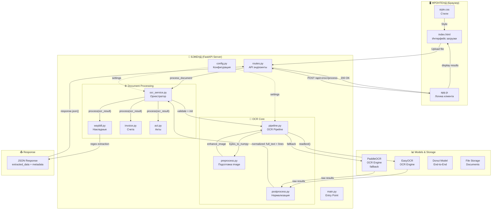

---

## 2. Поток обработки документа

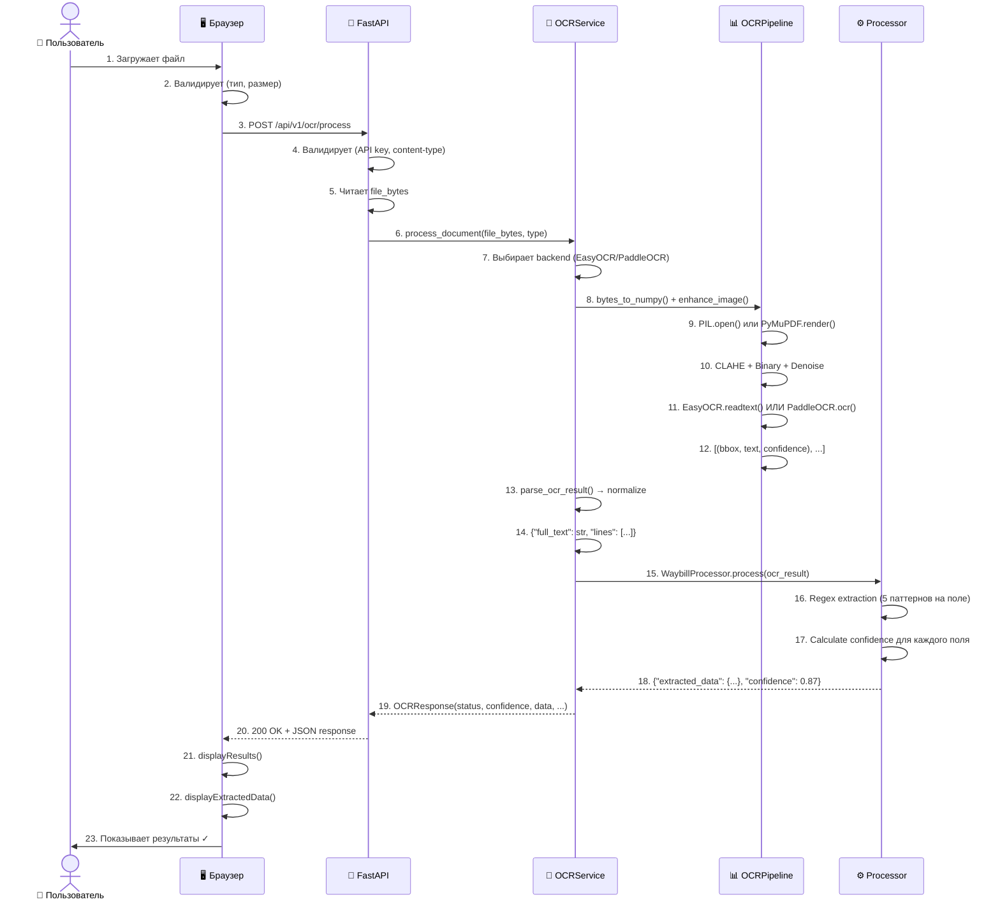

---

## 3. Архитектура OCR Pipeline

```mermaid
graph LR
    Input["🖼️ file_bytes<br/>JPG/PNG/PDF"]
    
    subgraph Preprocess["🔄 PREPROCESSING"]
        P1["Декодирование<br/>PIL.open()"]
        P2["RGB → BGR<br/>cv2.cvtColor()"]
        P3["CLAHE<br/>Контраст"]
        P4["Adaptive<br/>Binary"]
        P5["Морфология<br/>Denoise"]
        P6["Масштабирование<br/>если <500px"]
        
        P1 --> P2 --> P3 --> P4 --> P5 --> P6
    end
    
    subgraph OCRBackend["🧠 OCR ENGINE"]
        Backend{"OCR_BACKEND?"}
        Easy["🟢 EasyOCR<br/>(основной)"]
        Paddle["🟡 PaddleOCR<br/>(fallback)"]
        
        Backend -->|"Try"| Easy
        Backend -->|"if fail"| Paddle
        
        Easy --> EasyRead["Reader.readtext()<br/>CNN + RNN"]
        Paddle --> PaddleOCR["PaddleOCR.ocr()<br/>DB + CRNN"]
    end
    
    subgraph Postprocess["📊 POSTPROCESSING"]
        Parse["parse_ocr_result()"]
        Normalize["Нормализация<br/>в общий формат"]
        Structure["Структурирование<br/>lines + blocks"]
    end
    
    subgraph Output["📤 OUTPUT"]
        Result["OCRResult<br/>{full_text, lines, blocks}"]
    end
    
    Input --> Preprocess
    Preprocess --> P6
    P6 --> OCRBackend
    EasyRead --> Postprocess
    PaddleOCR --> Postprocess
    Parse --> Normalize --> Structure
    Structure --> Output
    
    style Easy fill:#90EE90
    style Paddle fill:#FFD700
```

---

## 4. Структура данных (Data Model)

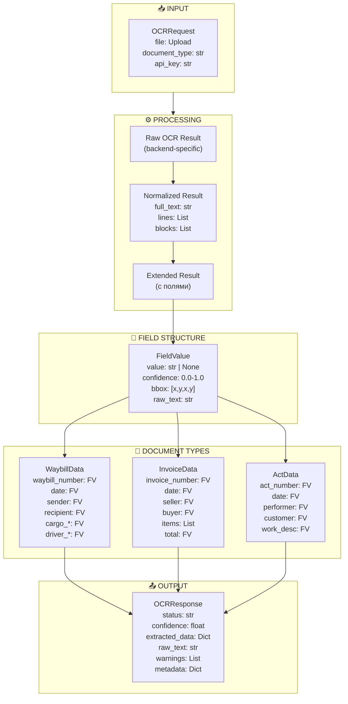

---

## 5. Web Interface Flow

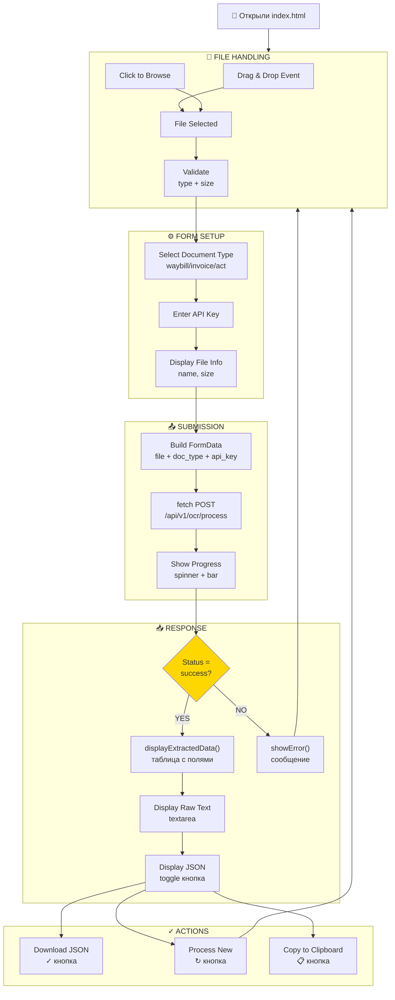

---

## 6. WaybillProcessor Regex Extraction

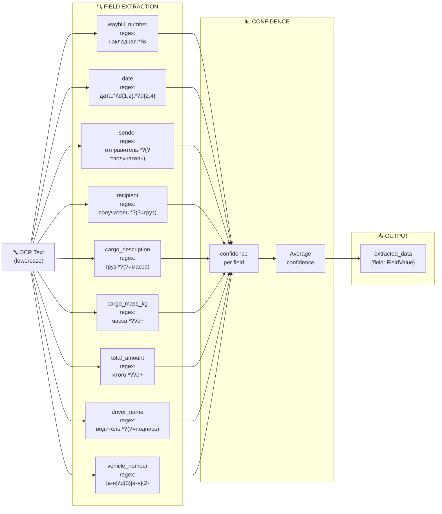

---

## 7. Performance Timeline

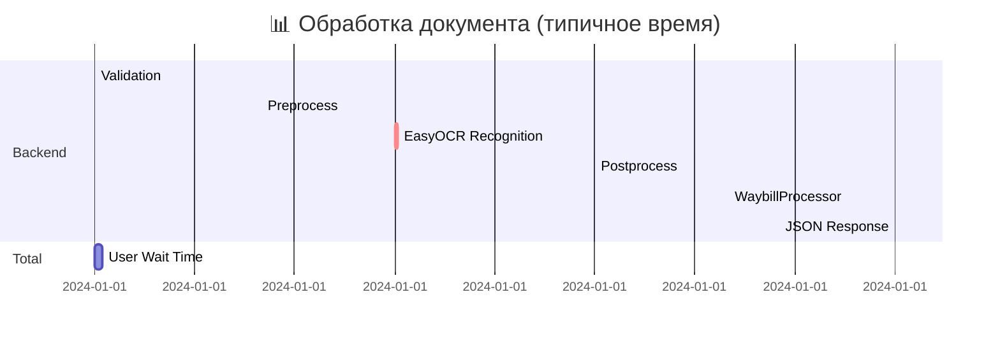

**Breakdown:**
- 🟢 Валидация: 50ms (5%)
- 🟡 Преобработка: 100ms (10%)
- 🔴 OCR: 1000ms (60%) ← **самое долгое**
- 🟢 Постобработка: 100ms (5%)
- 🟡 Процессор: 150ms (15%)
- 🟢 Ответ: 50ms (5%)

**Итого: ~2.4 секунды**

---

## 8. Error Handling Flow

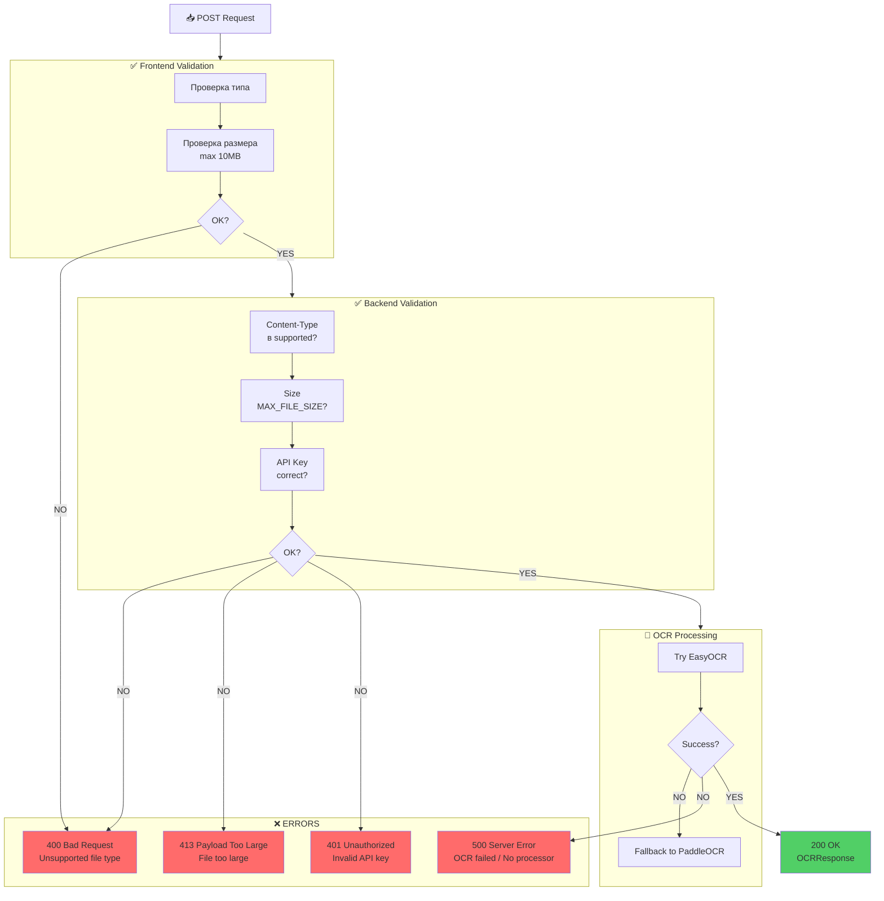

---

## 9. EasyOCR vs PaddleOCR Comparison

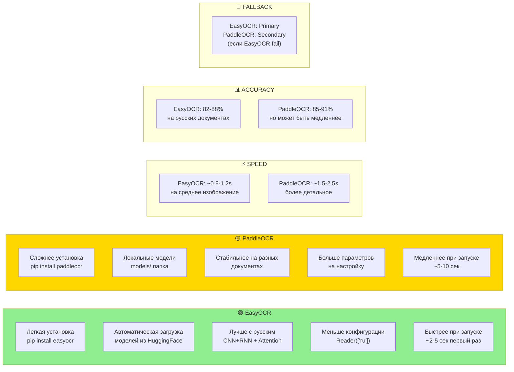

---

## 10. Development vs Production Setup

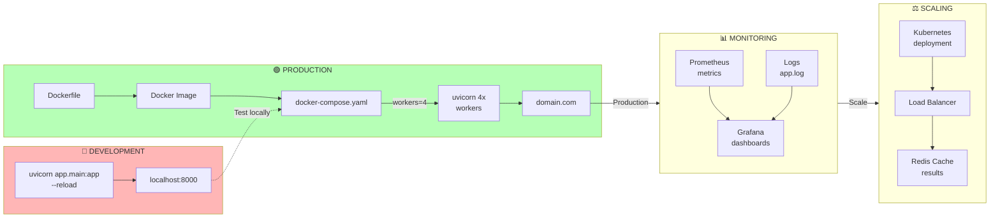

---

## 11. Configuration Hierarchy

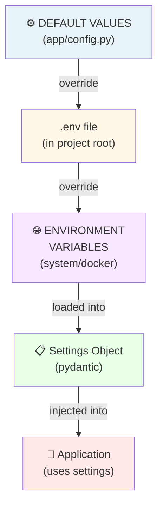

**Configuration Priority (높음 → 낮음):**
1. Environment Variables (최상위)
2. .env file
3. Default values in config.py (최하위)

